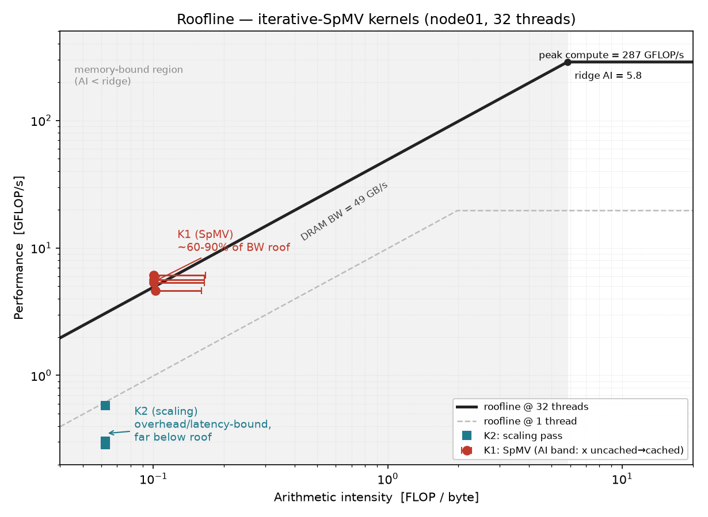
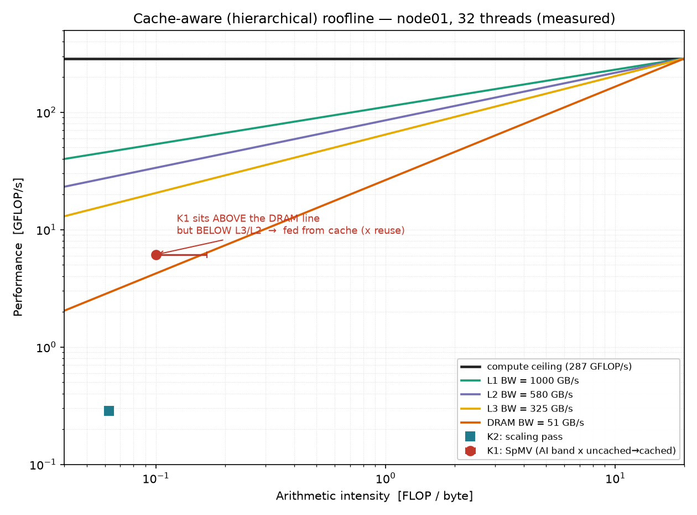
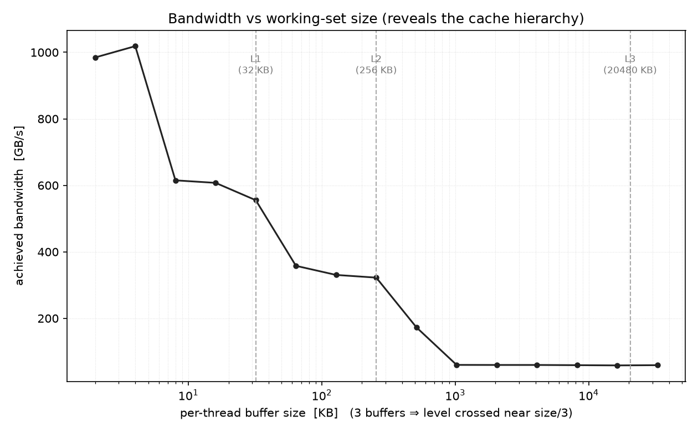

# Roofline analysis of the SpMV kernels

**Question this answers:** are the iterative-SpMV kernels actually **memory-bandwidth bound**
(→ at the algorithmic limit; micro-optimization is futile), or are they sitting **well below the
roofline** (→ "poor", with headroom from NUMA placement, gather latency, or vectorization)?

**Answer (cluster `node01`, 32 threads):** the dominant SpMV kernel (K1) is **memory-bandwidth
bound** — it runs at roughly **60–90% of the node's STREAM bandwidth**, with the exact fraction
set by how cacheable the input vector `x` is for a given matrix. There is little headroom from
code micro-optimization; the only meaningful levers are data *placement* (NUMA) and, for very
sparse matrices, removing the separate O(n) scaling pass. Details and numbers below.

The kernels are *shared* by all four implementations (sequential, threads, pool, OpenMP) — they
differ only in how the row range is scheduled, not in the arithmetic — so the roofline
characterizes the **kernels**, and each implementation's achieved point just moves along/under the
same ceilings. Tool: `bin/roofline` (`src/bench/roofline_bench.cpp`); see also
`PARALLEL_IMPLEMENTATIONS.md` for the kernels in context.

## The picture (and how to read it)



*(Generated by `.venv_pdf/bin/python scripts/plot_roofline.py` → `docs/roofline.png` / `.pdf`.)*

If the numbers below feel abstract, read them off this one chart. Both axes are logarithmic.

- **x-axis — arithmetic intensity (AI):** how many floating-point operations you do *per byte you
  fetch from memory*. SpMV does ~2 FLOPs per ~12–20 bytes, so AI ≈ 0.1 — i.e. the kernel spends
  almost all its time *moving data*, barely any *computing*.
- **y-axis — performance** in GFLOP/s (useful work per second).
- **The "roof" (the bent black line) is the hardware speed limit** at each AI:
  - the **sloped** part (left) is the **memory-bandwidth** limit, `performance = bandwidth × AI`
    — if your AI is low, this is the wall you hit;
  - the **flat** part (right) is the **compute** limit (FMA throughput);
  - they meet at the **ridge** (AI ≈ 5.8). Left of the ridge = **memory-bound**; right =
    compute-bound. Our kernels are *far* to the left.
- **Where a dot sits is the whole story:**
  - a dot **touching the sloped roof** ⇒ it is using essentially all the memory bandwidth the
    machine can give ⇒ **memory-bound**, and going faster needs an *algorithmic* change (move
    fewer bytes), not micro-tuning;
  - a dot **far below the roof** ⇒ it is *not* using the available bandwidth ⇒ it is limited by
    something else (loop/launch overhead, latency) ⇒ there is headroom.

On the chart, **K1 (red, the SpMV)** sits right under the bandwidth slope at AI ≈ 0.1 → it is
**memory-bandwidth bound** (the red whisker is the small uncertainty in its AI from `x` cache
reuse — the true point is somewhere along it). **K2 (teal, the scaling pass)** sits at AI = 0.0625
but *well below* the roof → it is tiny and overhead/latency-bound, not a bandwidth result. The
faint dashed line is the 1-thread roof; the solid one is at 32 threads — note the roof barely
rose (bandwidth saturates with only a few cores), which is the visual reason adding threads stops
helping.

## Cache-aware (hierarchical) roofline

The single-ceiling plot above has one awkward feature: at 32 threads some K1 points sit **above**
the DRAM roof, which looks impossible. It isn't — it is the signature of **cache reuse of `x`**.
The classic fix (and the version in the SPM notes) is the **cache-aware / hierarchical roofline**:
instead of one memory ceiling, draw **one sloped ceiling per memory level** (L1, L2, L3, DRAM),
each with its own bandwidth. A kernel is then bounded by the level that *actually feeds it*.



Now it makes sense: **K1 sits above the DRAM line but below the L3/L2 lines.** Its `x` vector
(0.8–4 MB, reused by every nonzero) is served largely from **L2/L3**, whose bandwidth is several
times DRAM's — so K1 legitimately beats the DRAM line while still being **bandwidth-bound**, just
against a *faster* level. The "unattainable" region is only unattainable for the level you name;
each level has its own roof, and K1 lives between the DRAM and L3 roofs.

**How the per-level bandwidths are measured (no hardware counters):** run the triad over
per-thread buffers of growing size. While the working set fits in a cache level the triad streams
from it; as it grows it spills L1 → L2 → L3 → DRAM, so the achieved bandwidth **plateaus** at each
level (`bin/roofline --cache-sweep`):



The measured **aggregate (32-thread) plateaus on `node01`** (caches: L1d=32 KB, L2=256 KB per
core, **L3=20 MB shared**):

| level | aggregate bandwidth | working set (per-thread buffer) |
|---|---|---|
| **L1** | ~1000 GB/s | ≤ 4 KB |
| **L2** | ~580 GB/s  | 8–32 KB |
| **L3** | ~325 GB/s  | 128–256 KB |
| **DRAM** | ~51–59 GB/s | ≥ 1 MB |

The high-buffer plateau (~59 GB/s) matches the STREAM DRAM peak (~51 GB/s); the L1 plateau is
~20× higher. **L3 = 20 MB is the key number:** every test matrix's `x` vector (0.8–4 MB) fits
comfortably in L3 (and the small ones in L2), so `x` is served from cache at 325–580 GB/s while
only the matrix stream (`values`+`col_idx`, 80–240 MB ≫ L3) and `y` hit DRAM. That is precisely
why K1's effective bandwidth beats the DRAM ceiling.

> **Caveat on L3:** the shared L3 plateau is somewhat compressed at full threads (the aggregate
> footprint crosses 20 MB quickly); L1/L2 (private per core) and DRAM are the cleanest plateaus.
> The single-thread sweep in `results_roofline/roofline.txt` gives the cleanest *per-core*
> hierarchy (L1≈71, L2≈40, L3≈23, DRAM≈10 GB/s). Regenerate the figures with
> `.venv_pdf/bin/python scripts/plot_roofline.py` after editing the embedded `HIER`/`SWEEP` data.

The takeaway is unchanged from the single-level analysis — K1 is memory-bound — but the
hierarchical view says it precisely: **K1 is bound by L2/L3 bandwidth for `x` plus DRAM bandwidth
for the matrix stream.** This also predicts the per-matrix spread seen in the single-DRAM table:
the densest matrix (200 nnz/row, most `x` reuse) rides furthest above the DRAM roof (125%), while
the sparsest (8 nnz/row, least reuse) sits right on it (90%).

## The two kernels

| | kernel | order | role |
|---|---|---|---|
| **K1** | fused shifted SpMV + L2 sum-of-squares (`y[(src+shift)%n]=Σ va·x[ci]; ss+=sum²`) | O(nnz) | Phase A — the dominant cost |
| **K2** | scaling pass (`y[(src+shift)%n] *= inv`) | O(n) | Phase B — pure streaming |

(The diagnostic Rayleigh SpMV is K1 run once out of 500 — negligible.)

## Method — empirical roofline (self-contained, no external tools)

Three measurements, all on one node with `OMP_PROC_BIND=close OMP_PLACES=cores`:

1. **Peak compute** (horizontal roof): a register-resident FMA microbench — 64 independent
   `a = a*b + c` chains per thread, no memory traffic. (An empirical lower bound on peak FLOP/s;
   it is not the binding roof here, since both kernels' AI is far below the ridge.)
2. **Peak bandwidth** (sloped roof): a **STREAM triad** `a[i] = b[i] + s·c[i]` over arrays far
   larger than last-level cache, **first-touched in parallel** so every page lands on the NUMA
   node of the thread that will use it and we measure the *full aggregate* bandwidth.
   `peak_GBs = 24·N·reps / time` (STREAM convention: 3 streams × 8 B; with write-allocate the true
   traffic is 32 B/elem, so this slightly under-counts bytes ⇒ a mildly conservative bandwidth).
   *Implementation note:* the buffers are allocated untouched (`new double[N]`, no zero-init) and
   first-touched in the parallel loop — using `std::vector` here would be a bug (its ctor zeroes
   on the master thread, faulting every page onto one socket; see the measurement note below).
3. **Kernel points**: K1 and K2 timed in isolation over `R` reps, each thread owning its
   **nnz-balanced** source-row range (exactly the threads version's partition), `__restrict__`
   applied (Opt D). The matrix, `x`, and `y` are first-touched **serially**, *precisely as the
   sequential/threads versions initialise them* — so the gap between a kernel's achieved bandwidth
   and the (parallel-first-touch) STREAM peak directly exposes any NUMA penalty.

### FLOP / byte model

```
K1  FLOPs = R·(2·nnz + 2·n)     Bytes = R·(B_nnz·nnz + 16·n)
      B_nnz = 8 (values) + 4 (col_idx) + [x gather]      per row: 8 (row_ptr) + 8 (write y)
      x gather: 8 B if uncached (worst case) .. 0 B if fully cached (best case)
      ⇒ B_nnz = 20 (uncached)  ..  12 (cached)            AI rises as x is cached
K2  FLOPs = R·n                 Bytes = R·(16·n)   (read 8 + write 8)
AI = FLOPs / Bytes              roofGFLOP/s = min(peak compute, peak BW · AI)
%roof = achieved GFLOP/s / roofGFLOP/s
```

`x` has only `n` doubles (0.8–4 MB) and is reused across all nonzeros, so it is partly
cache-resident; the truth lies between the uncached and cached ends. The tool prints the uncached
row (lowest AI, highest implied DRAM traffic) plus a `K1 AI band:` line giving the cached-`x`
estimate. Both AIs are far left of the ridge (≈ 2 at 1 thread, ≈ 6 at 32) — so the kernels are in
the **bandwidth-bound regime by construction**; the roofline's real job is the **%roof** number.

## How to run

```bash
make roofline
OMP_PROC_BIND=close OMP_PLACES=cores ./bin/roofline -n 500000 -nz 20000000 -m irregular -t 32
sbatch scripts/run_roofline.sbatch        # full sweep, t=1 and full node -> results_roofline/roofline.txt
```
CLI: `-n -nz -m [-s seed] [-t threads] [-R kernel_reps] [--stream-n elems] [--fma-iters n]`.

## Results (cluster `node01`, post-fix run, 2026-06-23)

### Node ceilings

| threads | peak compute (GFLOP/s) | peak bandwidth (GB/s) | ridge AI (F/B) |
|---|---|---|---|
| 1  | ~19.6 | ~9.9 | ~2.0 |
| 32 | ~287  | ~49  | ~5.8 |

- Peak compute scales **1 → 32 threads by ~14.6×**, *not* 32× — strong evidence the node has
  **~16 physical cores with 2-way SMT** (32 logical). So "t=32" is SMT-oversubscribed, and SMT
  does nothing for a bandwidth-bound kernel.
- Peak bandwidth scales only **~5×** (9.9 → ~49 GB/s) and saturates well before 32 threads —
  the memory system, not the core count, is the ceiling. ~49 GB/s is the node's aggregate DRAM
  bandwidth.

### K1 (dominant kernel) at 32 threads

| n | nz | nnz/row | achieved GFLOP/s | %roof (x uncached) | est. DRAM GB/s (x cached) | %roof (x cached) |
|---|---|---|---|---|---|---|
| 100000 | 4M  | 40  | 5.60 | 113% | 33.9 | 69% |
| 100000 | 20M | 200 | 6.12 | 124% | 36.8 | 74% |
| 500000 | 4M  | 8   | 4.60 | 90%  | 28.6 | 57% |
| 500000 | 20M | 40  | 5.34 | 110% | 32.3 | 67% |

How to read this: the *uncached* %roof exceeding 100% is **proof that `x` is substantially
cache-resident** — a kernel cannot really move data faster than the ~49 GB/s STREAM ceiling, so
its true DRAM traffic must be below the 20 B/nonzero worst case. The real operating point sits
between the two columns, i.e. K1 runs at roughly **60–90% of the node's STREAM bandwidth**:

- **Sparse, large `x`** (n=500000, nz=4M, 8 nnz/row): `x` is 4 MB, poorly cached ⇒ near-pure
  streaming of `values`/`col_idx`/`x` ⇒ even the *uncached* model is at **90% of roof**. Strongly
  bandwidth-bound.
- **Dense rows, small `x`** (n=100000, nz=20M, 200 nnz/row): `x` is 0.8 MB, heavily reused and
  cached ⇒ the realistic (cached) point is **~74% of roof** at the higher effective AI.

Either way K1 is at/near the **memory wall**. The remaining sub-100% gap (cached view) is
attributable to (i) the **serial first-touch NUMA placement** of the matrix/`x`/`y` — they sit on
one node while the STREAM ceiling was measured with parallel (all-node) placement — and (ii) the
**indirect-gather latency** of `x[col_idx[p]]`.

### K2 (scaling pass) at 32 threads

K2 is small (≈ 0.3–0.6 GFLOP/s, 9–19% of its roof) and its time is a fraction of K1's. Its low
%roof is **not** a bandwidth result — it reflects the per-element `(src+shift)%n` integer modulo,
the per-iteration parallel-region launch, and partial cache residency, not DRAM streaming. Its
*relevance* is the K2/K1 time ratio:

| n | nz | nnz/row | K2 time / K1 time |
|---|---|---|---|
| 100000 | 20M | 200 | ~6% |
| 500000 | 20M | 40  | ~21% |
| 100000 | 4M  | 40  | ~29% |
| 500000 | 4M  | 8   | **~40%** |

For the **sparsest** matrix the separate O(n) scaling pass costs ~40% of the SpMV — that is the
one place where **fusing the normalization into the next iteration's SpMV** (eliminating K2's full
read+write of the vector) would give a real, measurable win.

## Verdict

1. **K1 (the SpMV) is memory-bandwidth bound** — low arithmetic intensity, ~60–90% of the node's
   ~49 GB/s STREAM bandwidth at 32 threads, footprint ≫ LLC. It is **not poorly written**; classic
   well-tuned CSR SpMV reaches 50–80% of STREAM because of the indirect gather, so this is right in
   the expected band.
2. **This explains the scaling sweeps quantitatively.** Bandwidth saturates ~5× over one thread
   and the node is ~16 physical cores; so beyond a handful of cores extra threads cannot help, and
   K1's throughput plateaus at the memory ceiling — exactly the falling efficiency (≈ 0.2–0.35 at
   t=32) seen for `cde`/`pool` in the speedup study, and why static-vs-dynamic scheduling only
   shuffles a few percent rather than changing the asymptote.
3. **Highest-value future refinements** (not implemented — the versions already carry opts A–E):
   - **NUMA-aware first-touch** of the CSR arrays / buffers (parallel init by the owning threads),
     to close the gap between the kernels' one-node placement and the all-node STREAM ceiling.
   - **Fuse the normalization into the next SpMV** to delete the K2 pass — worth ~30–40% per
     iteration *only* in the sparse, low-nnz/row regime; negligible for dense rows.
   - **Software-prefetch** `x[col_idx[p+D]]` to hide gather latency where below the ceiling.
   - Replace the `%n` with a conditional subtract (valid since `src+shift < 2n`).

### Measurement note (why an earlier run looked impossible)

The first cluster run reported K1 at **170–227% of roofline** with "achieved" bandwidth *above*
the STREAM peak — impossible for a DRAM-bound kernel. Cause: the STREAM benchmark allocated its
arrays with `std::vector`, whose constructor zero-initializes on the **master thread**, faulting
every page onto **one NUMA node** before the parallel first-touch; the triad then measured a
single socket (~25 GB/s) instead of the node aggregate. Fixed by allocating untouched buffers and
first-touching in parallel (peak BW at 32 threads then rose to the correct ~49 GB/s and the
anomaly disappeared). The FMA microbench was also stiffened (64 chains) and a cached-`x` AI band
added. Lesson worth keeping in the report: **first-touch placement determines measured bandwidth**
— the very NUMA effect that also limits the real kernels.
